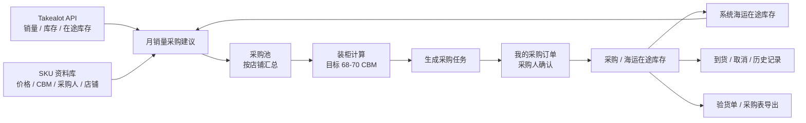
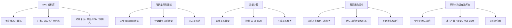

# 电商采购装柜轻型 ERP 客户展示方案

## 1. 一句话定位

这是一个面向电商多店铺采购的轻型 ERP 系统，用于把 Takealot 销量和库存数据自动转化为采购建议，再经过装柜计算、采购人确认、海运在途跟踪，形成从“销量预测”到“采购执行”的完整闭环。

## 2. 系统总逻辑图



客户说明话术：

系统每天自动同步各店铺 Takealot 数据，根据销量、南非库存、官方仓库存、送仓路上库存和我们的海运在途库存，生成建议采购数量。运营可以人工调整采购建议，再发送到装柜计算，控制整柜在 68-70 CBM。生成采购任务后，采购员登录系统查看自己的订单，确认采购后进入海运在途库存，后续可补充物流数据并导出验货单。

## 3. 页面职责图



## 4. 数据来源说明

| 数据 | 来源 | 用途 |
| --- | --- | --- |
| 月销量 | Takealot API `sales_units` | 计算基础需求 |
| 南非本地库存 | Takealot API `leadtime_stock.quantity_available` | 扣减采购需求 |
| 官方仓库存 | Takealot API `stock_at_takealot_total` | 扣减采购需求 |
| 送仓路上库存 | Takealot API `stock_on_way` / `total_stock_on_way` | 扣减采购需求 |
| 海运在途库存 | 系统采购 / 在途库存 | 扣减采购需求 |
| 采购单价 | SKU 资料库 | 计算预计金额 |
| 单品 CBM | SKU 资料库 | 计算预计装柜体积 |
| 采购人 | SKU 资料库 / 账号绑定 | 分配采购任务 |

## 5. 采购建议计算逻辑

基础公式：

```text
建议采购数量 =
月销量 × 备货月数
- 南非本地库存
- Takealot 官方仓库存
- 送仓路上库存
- 海运在途库存
```

备货月数规则：

```text
月销量 > 50：备货 4 个月
月销量 21-50：备货 3 个月
月销量 20 及以下：备货 2 个月
```

新品预测规则：

```text
Bestby
最新 1-60 个 SKU：销量 × 3
最新 61-100 个 SKU：销量 × 2
最新 101-200 个 SKU：销量 × 1.5

Arfast
最新 1-15 个 SKU：销量 × 3
最新 16-40 个 SKU：销量 × 1.5

Aicom
最新 1-25 个 SKU：销量 × 5
最新 26-50 个 SKU：销量 × 3
最新 51-90 个 SKU：销量 × 2

MegaValue / KeepFit / Lifon / PatPaw
暂不启用新品倍率，按正常月销量预测
```

说明：

新品通过 SKU 数值大小判断，SKU 越大越新。新品预测会在系统备注中显示，例如“新品预测：第 12 新，原始销量 8，按 3 倍预测”。

## 6. 采购执行 SOP

### Step 1：维护 SKU 资料库

负责人：管理员或运营

操作内容：

- 导入或维护 SKU 资料
- 确认厂家名、SKU、产品名称、店铺
- 维护采购单价、单品 CBM、采购人

检查重点：

- 未录入 SKU 资料的商品会在采购建议里标红
- 采购单价或 CBM 缺失会影响金额和装柜计算

### Step 2：同步 Takealot 数据

负责人：系统自动执行，也可人工触发

操作内容：

- 系统按定时任务同步 7 个店铺
- 页面也可以手动同步指定店铺

输出结果：

- 月销量
- 南非本地库存
- 官方仓库存
- 送仓路上库存
- 建议采购数量

### Step 3：生成采购建议

负责人：运营

操作内容：

- 查看各店铺建议采购数量
- 手动修改不合理的建议数量
- 将需要采购的商品加入本轮采购池

检查重点：

- 只处理建议采购数量大于 0 的商品
- 只标红未录入 SKU 资料的商品
- 新品预测只作为备注提示，不阻止加入采购

### Step 4：发送到装柜计算

负责人：运营

操作内容：

- 将采购池发送到装柜计算
- 调整采购数量和单行总 CBM
- 控制整柜目标在 68-70 CBM

输出结果：

- 一张可执行的装柜采购计划

### Step 5：生成采购任务

负责人：运营或管理员

操作内容：

- 从装柜计算生成采购任务
- 系统根据采购人分配订单
- 采购人登录后顶部显示待采购任务提醒

输出结果：

- 每个采购人只看到自己的采购任务

### Step 6：采购人确认订单

负责人：采购人

操作内容：

- 查看“我的采购订单”
- 确认实际采购数量
- 确认采购单价
- 填写备注
- 修改状态

说明：

采购确认阶段不强制填写物流数据。件数、重量、物流 CBM 可以等物流商回传后再补充。

### Step 7：采购 / 海运在途库存管理

负责人：管理员、运营、采购人

操作内容：

- 查看已确认采购
- 维护装货方式：整柜 / 冠通
- 维护件数、总重量、物流总 CBM
- 标记到货或取消
- 导出验货单

检查重点：

- 采购 / 在途库存只统计采购人确认后的数据
- 不直接把装柜计划当作在途库存
- 到货数据不删除，只做状态变更

## 7. 角色权限说明

| 角色 | 能做什么 |
| --- | --- |
| admin 管理员 | 查看和编辑全部数据，维护 SKU，管理采购和在途库存 |
| buyer 采购员 | 查看自己的采购订单，维护采购确认信息；可协作查看在途库存 |
| viewer 查看人员 | 只读查看，不修改数据 |

## 8. 客户演示顺序

建议录屏或现场演示按下面顺序：

1. 登录系统，说明这是内部多人在线工作台
2. 展示 SKU 资料库，说明商品主数据来源
3. 打开月销量采购建议，展示 Takealot API 同步
4. 说明采购建议公式和新品预测规则
5. 手动修改一个建议采购数量
6. 加入本轮采购池
7. 发送到装柜计算
8. 调整到 68-70 CBM
9. 生成采购任务
10. 切换到“我的采购订单”，展示采购人收到任务
11. 采购人确认采购数量和价格
12. 打开采购 / 海运在途库存
13. 补充件数、重量、物流 CBM
14. 导出验货单

## 9. 客户介绍话术

### 开场

这套系统解决的是电商采购中最容易混乱的几个问题：销量数据分散、采购预测靠人工、装柜体积难控制、采购任务分配不清楚、海运在途库存不透明。系统把这些环节串成一个闭环，让每一次采购都能从数据预测开始，到采购执行、物流跟踪和后续补货建议结束。

### 介绍月销量采购建议

系统会从 Takealot 同步销量和库存数据，再结合我们自己的海运在途库存，自动计算每个 SKU 还需要采购多少。新品因为上线时间短，销量不能直接按当前销量判断，所以系统按不同店铺设置了新品预测倍率。

### 介绍装柜计算

采购建议不是直接下单，而是先进入装柜计算。运营可以根据柜容目标调整采购数量，确保整柜控制在 68-70 CBM，减少不满柜或超柜风险。

### 介绍采购任务分配

装柜计划确认后，系统会生成采购任务，并按采购人分配。采购员登录后只看到自己的任务，减少人工转发表格和漏单风险。

### 介绍在途库存

采购人确认后，订单才进入采购 / 海运在途库存。物流商回传件数、重量和 CBM 后，可以继续补充维护。到货后只变更状态，不删除历史记录。

## 10. 录屏脚本

```text
大家好，这里演示的是我们的电商采购装柜工作台。

首先进入 SKU 资料库，这里维护所有商品的基础资料，包括厂家、SKU、产品名称、采购单价、单品 CBM 和采购人。

接着进入月销量采购建议。系统可以自动同步 Takealot 的销量、南非库存、官方仓库存和送仓路上库存，并结合系统里的海运在途库存，自动生成建议采购数量。

这里的建议采购数量可以人工调整。对于新品，系统会根据不同店铺的新 SKU 规则做销量放大预测。

确认后，我们把商品加入本轮采购池，再统一发送到装柜计算。

在装柜计算页面，可以继续调整采购数量和总 CBM，把整柜控制在 68-70 方。

装柜确认后，点击生成采购任务，系统会自动分配给对应采购人。

采购人登录后，可以在顶部看到待采购任务提醒，并进入我的采购订单确认实际采购数量、价格和状态。

采购确认后，数据进入采购 / 海运在途库存。后续可以维护装货方式、件数、重量、物流总 CBM，并导出验货单。

整套流程实现了从销量预测、装柜计划、采购任务到海运在途跟踪的闭环管理。
```

## 11. 建议交付材料

给客户展示建议准备三份材料：

- 一页系统流程图
- 一页 SOP 步骤图
- 一段 3-5 分钟录屏视频

如果客户偏管理层，重点讲效率和可视化。

如果客户偏操作人员，重点演示如何同步、如何加入采购池、如何确认采购、如何导出验货单。

